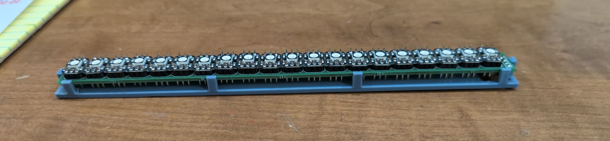
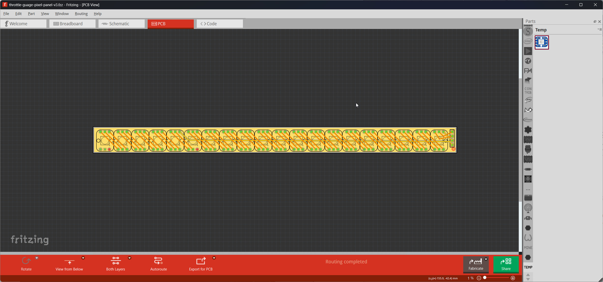
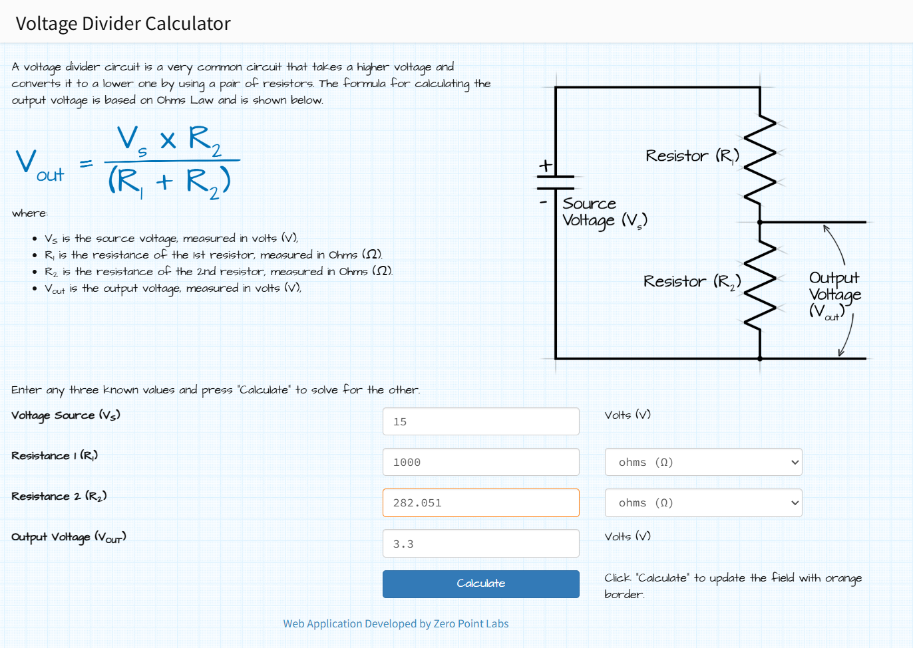

# Throttle Gauge

> This is a WORK IN PROGRESS

A simple throttle guage using a strip of NeoPixels and an Adafruit Feather device.

## Background

for my friend's Porsche Boxter race car.

## Hardware Components

+ [Adafruit ESP32-S3 Feather with 4MB Flash 2MB PSRAM](https://www.adafruit.com/product/5477)
+ [Breadboard-friendly RGB Smart NeoPixel - Sheet of 25](https://www.adafruit.com/product/1558)
+ [12V to 5V DC Buck Converter](https://www.amazon.com/Converter-Voltage-Waterproof-Regulator-Step-Down/dp/B07Y2V1F8V)

## Building the NeoPixel Strip

The guage is a strip of 20 Adafruit NeoPixels arranged in a strip. The first 15 represent the throttle position (from 1 to 15). Illuminating the NeoPixels in Green until the throttle hits 80%, then all NeoPixels turn White. The last 5 NeoPixels indicate whether the brake is on or off; the final 5 NeoPixels illuminate Red when the driver presses the brake pedal.




To make the gauge easier to assemble, I created a circuit board for it using [Fritzing](https://fritzing.org/). I always wanted to learn how to design my own circuit boards, so this was my very first. You can find the design for the board in the repository's [Fritzing](Fritzing) folder.



## Assembling the Hardware


## Project Source Code


### Inputs and Outputs

The circuit drives the NeoPixel arrays on the ESP32's digital pins 2 (throttle) and 3 (brake). 

``` c
#define NUM_BRAKE_LEDS 5
#define NUM_THROTTLE_LEDS 15

#define BRAKE_LED_PIN 3
#define THROTTLE_LED_PIN 2
```

The circuit reads the throttle and brake inputs via analog inputs A0 and A1:


``` c
#define INPUT_BRAKE A0
#define INPUT_THROTTLE A1
```


## Reference

[Voltage Divider](https://ohmslawcalculator.com/voltage-divider-calculator)


