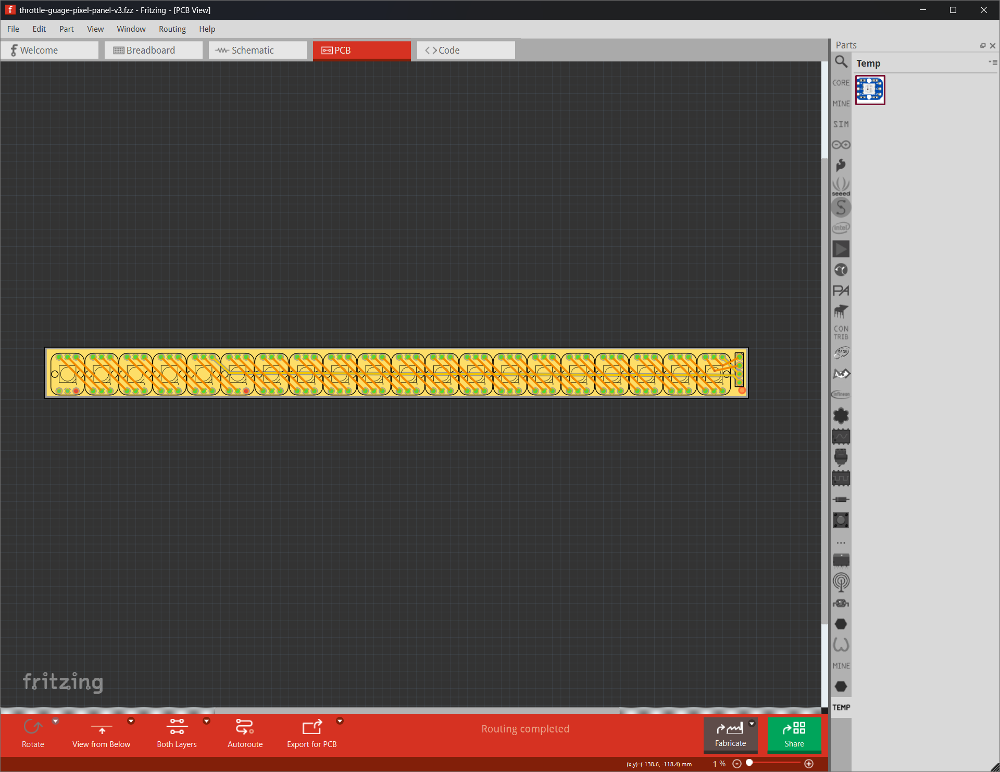

# Throttle Gauge

> This is a WORK IN PROGRESS

A simple throttle gauge using a strip of NeoPixels and an Adafruit Feather device.

## Background

My friend Scott has a Porsche Boxter he uses for Autocross Racing; you may know Scott as the designer that helps make most of my apps and sites look good. He had a custom throttle gauge made out of a bunch of LEDs mounted under the hood of the car so when he videotaped his runs, he could watch how us uses the throttle and brakes as he works his way through the course.

For a variety of reasons, his existing gauge wasn't working for him; the biggest issue was that he had multiple wires running to each LED and with all the forces operating on the car during a run, LEDs or wire connections were starting to fail.

He asked me if I could help him build a new, more stable version and I did; this project contains the source files for that project.

He essentially wanted two separate gauges: throttle and brakes. He wanted a sort of meter that showed in real-time how hard he was pushing on the accelerator. He also wanted to know when he was pushing on the brakes. 

I decided to use a strip of 25 Adafruit NeoPixel devices, 20 for the throttle and 5 for the brake indicator. 

For the throttle, the 20 LEDs illuminate in sequence, illuminating a single LED green when he pushes lightly on the accelerator and all 20 illuminated when the accelerator's pushed all the way to the floor. At 80% throttle, the LEDs switch from green to white, so on the video recording its easier to see that the accelerator's floored.

For the brake gauge, the gauge is binary, all LEDs on and Red when he depresses the brake pedal and all off when the pedal is not depressed.


## Hardware Components

I built the project using the following components:

+ [Adafruit ESP32-S3 Feather with 4MB Flash 2MB PSRAM](https://www.adafruit.com/product/5477)
+ [Breadboard-friendly RGB Smart NeoPixel - Sheet of 25](https://www.adafruit.com/product/1558)
+ [12V to 5V DC Buck Converter](https://www.amazon.com/Converter-Voltage-Waterproof-Regulator-Step-Down/dp/B07Y2V1F8V) to power the LEDs and Feather device.

## Building the NeoPixel Strip


To make the gauge easier to assemble, I created a circuit board for it using [Fritzing](https://fritzing.org/). I always wanted to learn how to design my own circuit boards, so this was my very first. You can find the design for the board in the repository's [Fritzing](Fritzing) folder. 

Rather than manage with the throttle and brake LEDs as a single unit in the code, I decided to separate them in the hardware design. So, the throttle gauge is a strip of 20 interconnected NeoPixels connected to VCC, GND, and one of the digital output pins on the Feather device through header pins on the edge of the circuit board. The brake gauge is 5 interconnected NeoPixels connected the same way, only to a different digital output pin on the Feather device. 


This allows me to update the LED arrays separately in the code and not worry about the state of the others. 



## Assembling the Hardware


## Project Source Code


### Inputs and Outputs

The circuit drives the NeoPixel arrays on the ESP32's digital pins 2 (throttle) and 3 (brake). 

``` c
#define NUM_BRAKE_LEDS 5
#define NUM_THROTTLE_LEDS 15

#define BRAKE_LED_PIN 3
#define THROTTLE_LED_PIN 2
```

The circuit reads the throttle and brake inputs via analog inputs A0 and A1:


``` c
#define INPUT_BRAKE A0
#define INPUT_THROTTLE A1
```


## Reference

[Voltage Divider](https://ohmslawcalculator.com/voltage-divider-calculator)


